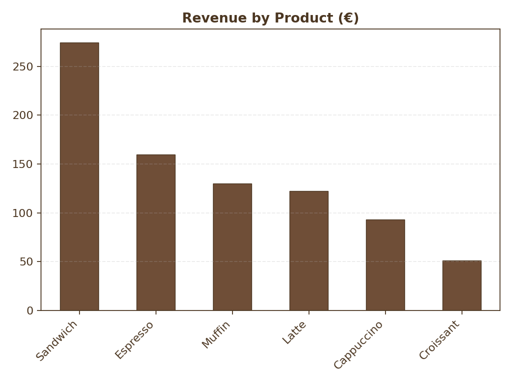
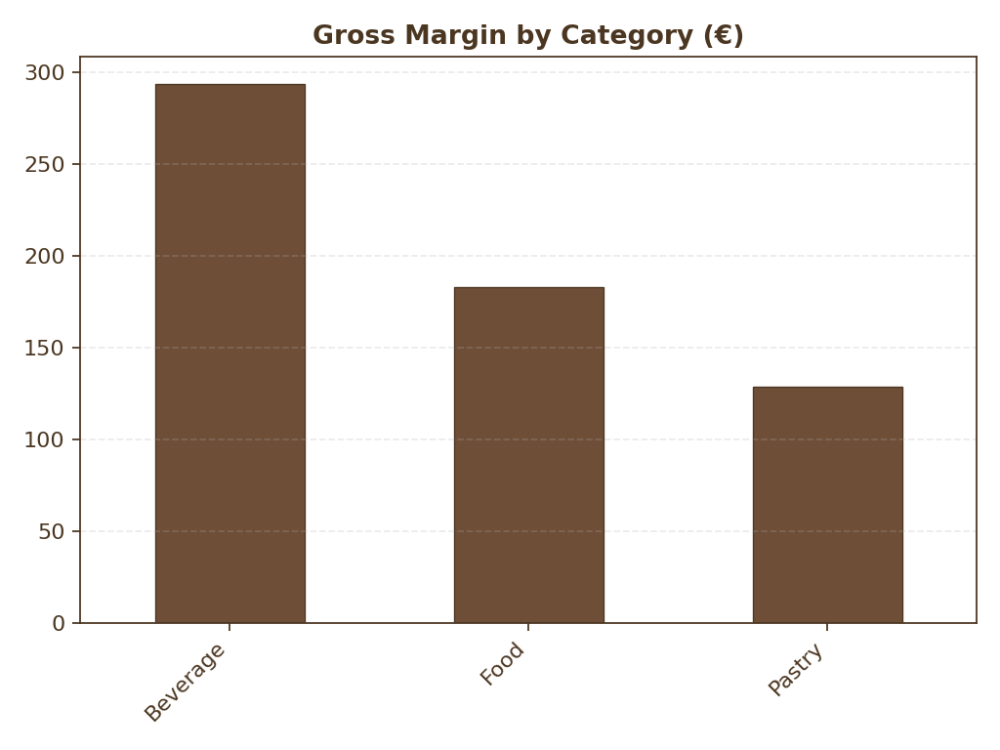
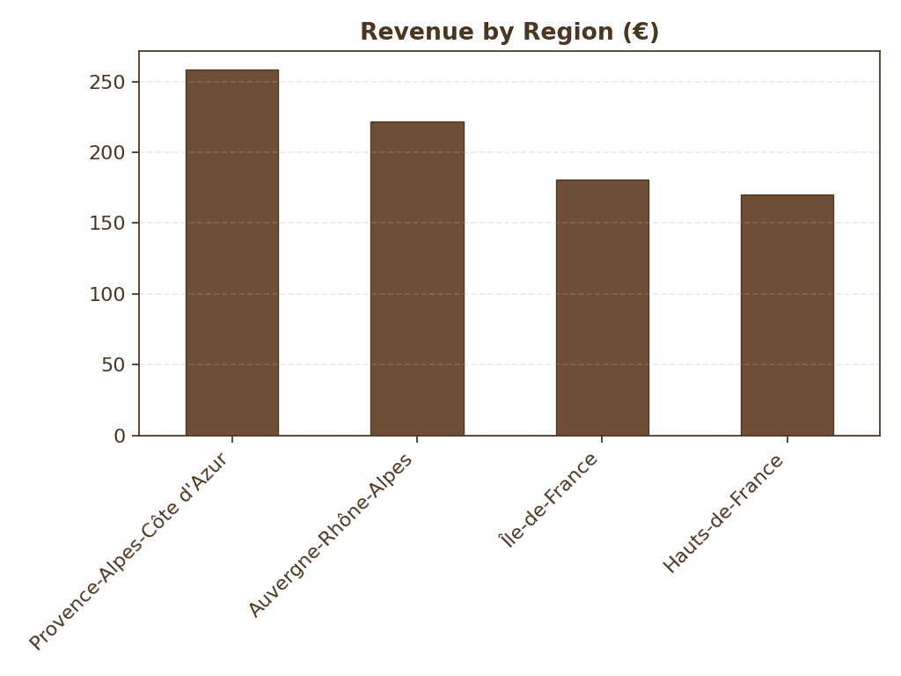
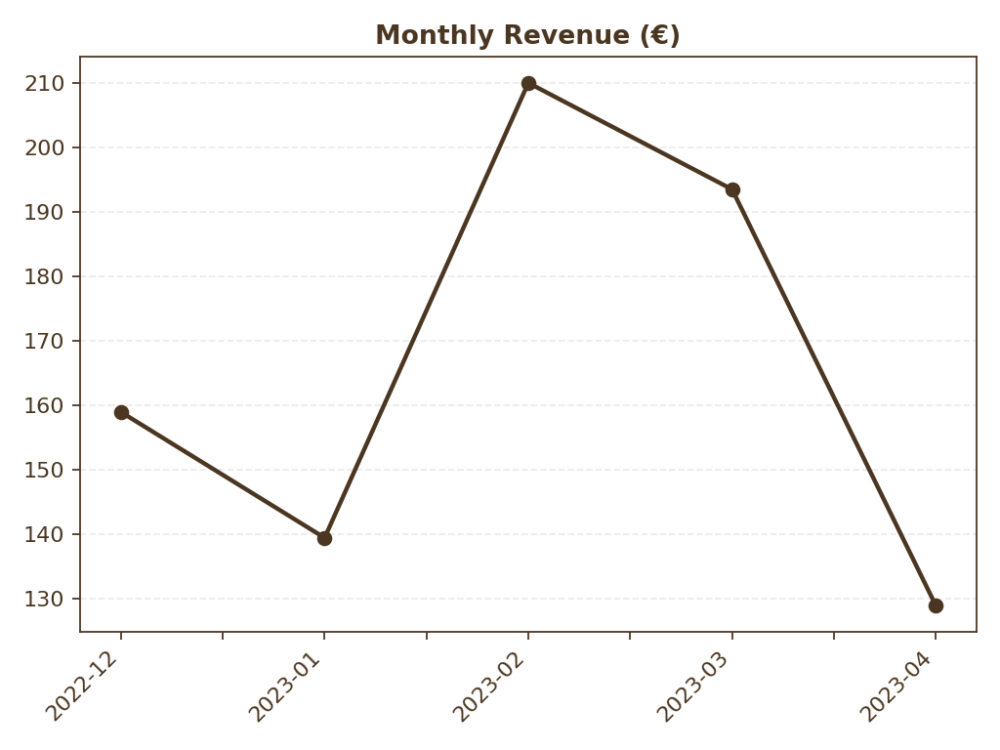
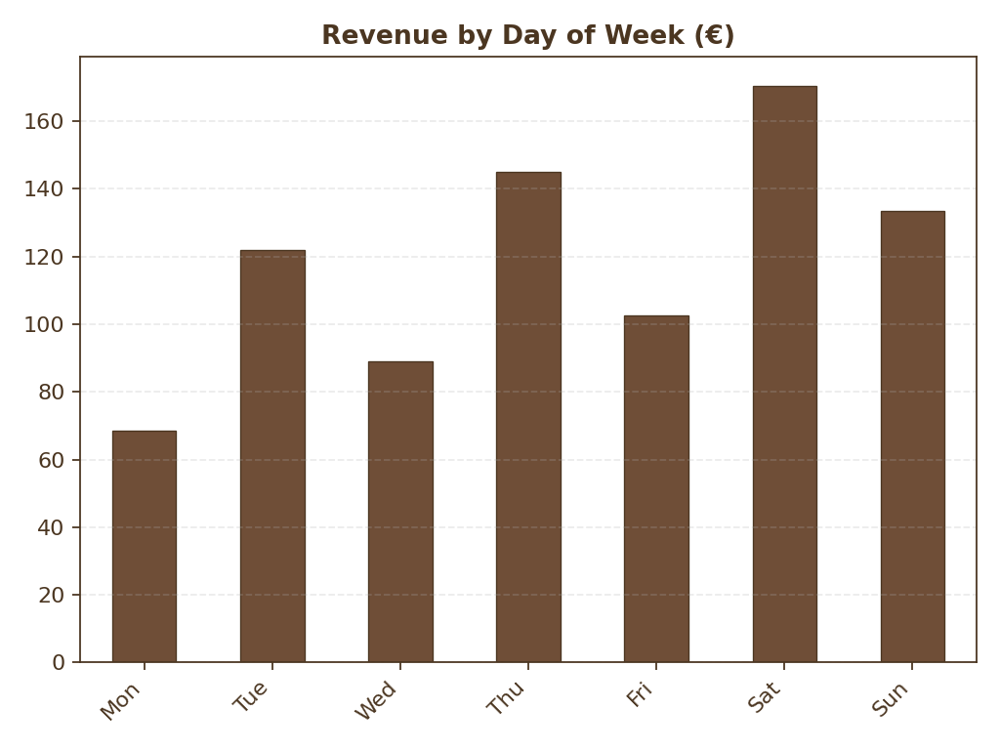

# ☕ Coffee Sales Analysis – PostgreSQL & Python

## 📌 Project Overview
This project focuses on analyzing the sales performance of a French coffee shop chain using **PostgreSQL** for database management and **Python** for data visualization.  
The goal is to demonstrate a complete end-to-end data analysis workflow, from database creation to business insights, while showcasing technical skills in SQL and Python.

## 🛠 Technical Stack
- **PostgreSQL** – Database creation, table management, and SQL queries.  
- **SQL** – Data aggregation, joins, grouping, and performance optimization with indexes.  
- **Python (Pandas, Matplotlib)** – Automating query execution and generating visualizations.

## 📂 Project Steps
### 1 - Database Setup
- Created a PostgreSQL database (`coffee_sales`).
- Designed and created tables: `stores`, `products`, `customers`, `sales`.
- Imported CSV datasets using `\copy` for efficient bulk loading.

### 2 - SQL Queries
Wrote multiple analytical queries to answer business questions:
1. Revenue per product.  
2. Gross margin by product category.  
3. Revenue by store region.  
4. Monthly revenue trends.  
5. Revenue by day of the week.  

### 3 - Data Visualization with Python
- Connected Python to PostgreSQL using `psycopg2` and `pandas`.
- Automated query execution and chart generation.
- Saved visualizations as `.png` files for reporting and documentation.

---

## 📊 Analysis & Visualizations

### 1️⃣ Revenue by Product
<p align="center">

</p>

**SQL Query:**
```sql
SELECT p.product_name AS label,
       SUM(s.quantity * p.price) AS value
FROM sales s
JOIN products p USING (product_id)
GROUP BY p.product_name
ORDER BY value DESC;
```
Analysis:
Sandwiches, Espresso, and Latte are the top revenue generators.
Recommendation: Increase stock and marketing for top-selling products during peak hours.

### 2️⃣ Gross Margin by Category
<p align="center">  </p>

**SQL Query:**
```sql
SELECT p.category AS label,
       SUM(s.quantity * (p.price - p.cost)) AS value
FROM sales s
JOIN products p USING (product_id)
GROUP BY p.category
ORDER BY value DESC;
```
Analysis:
Hot Drinks and Food items generate the highest gross margins.
Recommendation: Focus promotions on these high-margin categories.


### 3️⃣ Revenue by Region
<p align="center">  </p>


**SQL Query:**
```sql
SELECT st.region AS label,
       SUM(s.quantity * p.price) AS value
FROM sales s
JOIN stores st USING (store_id)
JOIN products p USING (product_id)
GROUP BY st.region
ORDER BY value DESC;
```
Analysis:
Provence-Alpes-Côte d'Azur and Auvergne-Rhône-Alpes are the most profitable regions.
Recommendation: Consider expanding operations in these high-performing areas while testing new communication strategies and special offers in regions with lower performance.


### 4️⃣ Monthly Revenue
<p align="center">  </p>

**SQL Query:**
```sql
SELECT DATE_TRUNC('month', s.sale_date) AS label,
       SUM(s.quantity * p.price) AS value
FROM sales s
JOIN products p USING (product_id)
GROUP BY label
ORDER BY label;
```
Analysis:
Revenue peaks in March, with a noticeable drop in May.
Recommendation: Investigate the causes of the May decline, compare with last year's sales for the same period, and analyze each store’s results in May to determine whether the drop is local or nationwide.

### 5️⃣ Revenue by Day of the Week
<p align="center">  </p>

**SQL Query:**
```sql
SELECT TO_CHAR(s.sale_date, 'Day') AS label,
       SUM(s.quantity * p.price) AS value
FROM sales s
JOIN products p USING (product_id)
GROUP BY label
ORDER BY value DESC;
```
Weekends (Saturday and Sunday) generate the highest revenue, mainly due to the weekend rest system.
Recommendation: Increase staff and inventory during weekends to meet higher demand, while creating special offers for the weakest day of the week to boost its performance.

---

---

## 📈 Conclusion & Next Steps

This analysis provided key insights into product performance, category profitability, regional revenue distribution, and seasonal sales trends for the coffee shop chain.  
By leveraging **PostgreSQL** for data processing and **Python** for automated visualizations, we built a clear, data-driven view of the business.

**Key Takeaways:**
- Sandwiches, Espresso, and Latte are the main revenue drivers, making them key items to prioritize in stock and promotions.
- Hot Drinks and Food generate the strongest profit margins, offering clear opportunities to focus marketing and upselling efforts.
- Provence-Alpes-Côte d'Azur and Auvergne-Rhône-Alpes outperform other regions, suggesting potential for strategic expansion.
- Sales peak in March and during weekends, highlighting opportunities for targeted promotions and optimized staffing.

**Potential Improvements:**
- Integrate customer demographics for deeper segmentation.
- Add time-series forecasting models to predict future sales.
- Automate dashboard generation for real-time monitoring.

💡 *This project is part of my Data Analytics portfolio, using fictional sales data to demonstrate my ability to work with PostgreSQL for the creation of relational databases, perform advanced multi-table SQL queries, and extract actionable business insights. The analysis showcases how I can rapidly transform raw data into clear visualizations and recommendations for business teams.*


